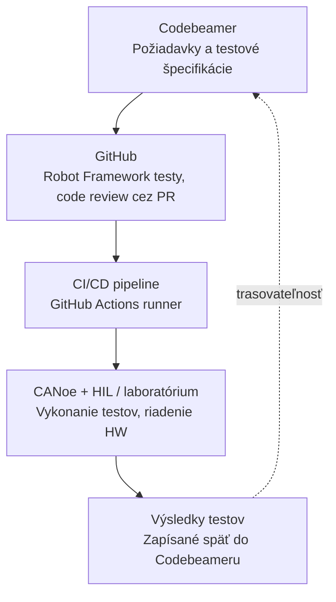
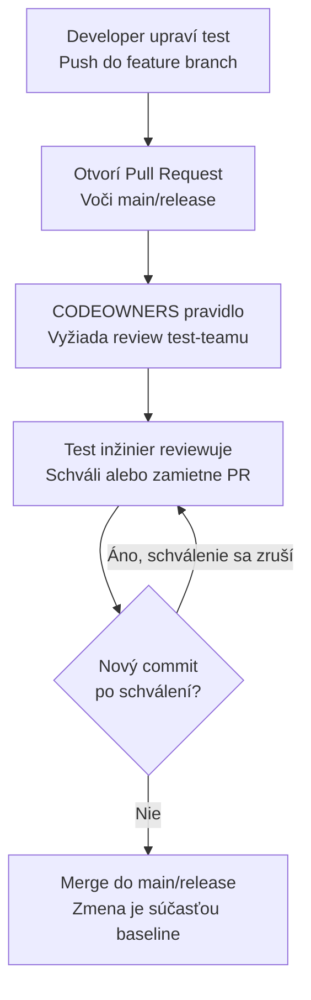

# 🤖 Automatizácia testovania embedded softvéru — architektúra a governance 🧪

Dokumentácia architektúry nástrojového reťazca (Codebeamer, GitHub, CI/CD, CANoe) a pravidiel oddelenia vývoja od testovania v GitHub, tak aby bola zachovaná obojsmerná trasovateľnosť vyžadovaná **ASPICE** a **ISO 26262**.

## 📋 Obsah

1. [Architektúra riešenia](#1-architektúra-riešenia)
2. [Trasovateľnosť a mapovanie na ASPICE / ISO 26262](#2-trasovateľnosť-a-mapovanie-na-aspice--iso-26262)
3. [Oddelenie vývoja a testovania v GitHub](#3-oddelenie-vývoja-a-testovania-v-github)
4. [Workflow schvaľovania zmeny testu](#4-workflow-schvaľovania-zmeny-testu)
5. [Checklist pre review zmeny testu](#5-checklist-pre-review-zmeny-testu)
6. [Príklady](#6-príklady)

---

## 🏗️ 1. Architektúra riešenia

Cieľom je prepojiť požiadavky, testy písané v Robot Frameworku, GitHub repozitár a review testov (Codebeamer alebo GitHub), a následne prepojiť testy a ich výsledky s test runom v Codebeameri alebo priamo v GitHub.



| Krok | Popis |
|---|---|
| 1. Codebeamer | Zdroj pravdy pre požiadavky a testové špecifikácie, baseline verzie. |
| 2. GitHub | Robot Framework testy, implementácia, code review cez Pull Request. |
| 3. CI/CD pipeline | GitHub Actions self-hosted runner, spúšťa testy pri merge/tagu. |
| 4. CANoe + HIL/laboratórium | Vykonanie testov, riadenie laboratórneho HW (napr. cez SCPI/TCP-IP). |
| 5. Výsledky testov | Parsovanie `output.xml` a zápis Test Run / výsledku späť do Codebeameru cez REST API. |

### Requirement ID a tagovanie

Prepojenie medzi Codebeamerom a testom sa realizuje cez requirement ID uvedené v `[Tags]` Robot Framework testu (napr. `REQ-1234`). Toto ID sa následne prenáša aj do zápisu Test Run výsledku, čím vzniká plný reťazec:

```
Požiadavka (CB) → Testový prípad (Robot Framework, GitHub) → Implementácia (commit)
→ Vykonanie (CI/CD + CANoe) → Výsledok (Test Run v CB)
```

---

## 🔗 2. Trasovateľnosť a mapovanie na ASPICE / ISO 26262

| Požiadavka | Ako je pokrytá |
|---|---|
| Obojsmerná trasovateľnosť | Requirement ID tag ↔ Codebeamer Test Case ↔ Test Run. |
| Konfiguračný manažment | Git tagy/releases zosynchronizované s baseline v Codebeameri. |
| Evidencia peer review | Schválenia Pull Requestov v GitHub, prípadne review workflow v Codebeameri. |
| Reprodukovateľnosť výsledkov | CI/CD logy a artefakty (`log.html`, HW konfigurácia) archivované per build. |
| Impact analýza pri zmene požiadavky | Codebeamer zobrazí naviazané testy pri zmene requirement work item. |

---

## 🛡️ 3. Oddelenie vývoja a testovania v GitHub

### Princíp

GitHub nerozlišuje "developera" a "test inžiniera" ako role – rozlišuje len teamy a oprávnenia. Aby zmena testu nemohla prejsť bez vedomia test inžiniera, musia platiť súčasne tri veci:

1. Developer nemôže priamo pushnúť zmenu do chránenej vetvy (`main`/`release`) – iba cez Pull Request.
2. Akákoľvek zmena súboru v `/tests` musí mať schválenie od `test-team` (CODEOWNERS) – bez ohľadu na to, kto PR založil.
3. Ak niekto pridá nový commit po tom, čo bol PR už schválený, staré schválenie sa automaticky zruší (*dismiss stale approvals*) – takže dodatočná úprava po schválení nemôže prejsť ďalej bez nového review.

### Štruktúra repozitára

| Možnosť | Popis | Kedy použiť |
|---|---|---|
| Samostatný repozitár `test-automation` | Testy fyzicky oddelené od SW kódu, vlastný lifecycle a oprávnenia. | Prísnejší ASPICE audit, väčší tím. |
| Zdieľaný repozitár, adresár `/tests` | Testy vedľa SW kódu, oddelenie iba cez CODEOWNERS. | Menší projekt, tesná previazanosť s buildom. |

V oboch prípadoch platí: **vlastníctvo adresára/repozitára patrí test tímu**, vývojári majú `write` prístup iba na feature branch, nikdy priamo na chránenú vetvu.

### CODEOWNERS

```
# .github/CODEOWNERS
# Testovacie súbory vyžadujú schválenie test tímu,
# bez ohľadu na to, kto Pull Request založí
/tests/                    @firma/test-engineers
*.robot                    @firma/test-engineers
/resources/keywords/       @firma/test-engineers
```

### Nastavenia repozitára (GitHub Ruleset)

Settings → Rules → Rulesets, pre vetvu `main` a `release/*`:

| Nastavenie | Hodnota | Dôvod |
|---|---|---|
| Require a pull request before merging | zapnuté | žiadny priamy push do chránenej vetvy |
| Require review from Code Owners | zapnuté | vynucuje schválenie CODEOWNERS |
| Required approvals | min. 1 | aspoň jedno nezávislé schválenie |
| Dismiss stale approvals on new commits | zapnuté | zabraňuje dopushnutiu zmeny po schválení |
| Require approval of the most recent push | zapnuté | autor nemôže schváliť vlastný posledný commit |
| Require signed commits | odporúčané | jednoznačná identita autora zmeny |
| Block force pushes | zapnuté | zabraňuje prepísaniu histórie |
| Require linear history | zapnuté | čistá, auditovateľná história |
| Do not allow bypassing | bez výnimky | ani repo admin neobíde pravidlá |
| Restrict who can push | `release-manager`, CI účet | vylučuje priamy zásah kohokoľvek iného |

Príklad exportu rulesetu:

```json
{
  "name": "protect-tests-and-release",
  "target": "branch",
  "enforcement": "active",
  "conditions": { "ref_name": { "include": ["refs/heads/main", "refs/heads/release/*"] } },
  "rules": [
    { "type": "pull_request", "parameters": {
        "required_approving_review_count": 1,
        "dismiss_stale_reviews_on_push": true,
        "require_code_owner_review": true,
        "require_last_push_approval": true
    }},
    { "type": "required_signatures" },
    { "type": "non_fast_forward" }
  ],
  "bypass_actors": []
}
```

Prázdne `bypass_actors` je zámerné — nikto, vrátane adminov, nesmie pravidlo obísť.

### Ochrana release baseline (tagy)

Settings → Tag protection rules: vzor `v*.*.*` môže vytvárať/mazať iba `release-manager` team. Tag reprezentuje presnú verziu testov spustenú proti konkrétnemu SW buildu a musí zostať nemenný ako dôkaz pre audit.

### Evidencia pre audit

- história Pull Requestov vrátane reviewerov, komentárov a času schválenia,
- záznam o zamietnutých force-push pokusoch,
- (GitHub Enterprise) Audit log so záznamom zmien oprávnení, rulesetov a merge udalostí.

### Voliteľné rozšírenie: fork-based model

Pri väčšom alebo menej dôveryhodnom vývojárskom tíme môžu mať vývojári do test repozitára iba `read` prístup a zmeny navrhujú výhradne cez **fork + Pull Request**. Vývojár tak fyzicky nemá možnosť pushnúť branch priamo do repozitára — jediná cesta je PR z forku, ktorý prechádza rovnakým CODEOWNERS/ruleset mechanizmom.

### Zhrnutie zodpovednosti

| Rola | Oprávnenie v test repozitári |
|---|---|
| Test inžinier (CODEOWNERS) | Write + schvaľovanie PR, vlastníctvo `/tests` |
| Release manager | Správa tagov, výnimka pre merge do `release/*` |
| Developer | Read, prípadne write len na feature branch/fork, žiadne právo mergovať bez schválenia |
| CI service účet | Read pre checkout, write iba pre publikáciu výsledkov |

---

## 🔄 4. Workflow schvaľovania zmeny testu



1. Developer upraví test a pushne zmenu do feature branch.
2. Otvorí Pull Request voči vetve `main`/`release`.
3. CODEOWNERS pravidlo automaticky vyžiada review od test-teamu.
4. Test inžinier zmenu preskúma a schváli alebo zamietne PR.
5. Rozhodovací bod — bol po schválení pridaný nový commit?
   - **Áno** → schválenie sa automaticky zruší (*dismiss stale approval*) a proces sa vracia na krok 4.
   - **Nie** → PR môže pokračovať na merge.
6. Merge do `main`/`release` — zmena sa stáva súčasťou baseline.

---

## ✅ 5. Checklist pre review zmeny testu

Kontrolné body, ktoré by mal test inžinier overiť pri každom Pull Requeste meniacom existujúci test:

- **Súlad s požiadavkou** — test stále overuje presne to, čo hovorí naviazaný requirement (REQ-ID). Zmena očakávaného výsledku vyžaduje zodpovedajúcu zmenu v Codebeameri.
- **Nezoslabenie assercie** — uvoľnenie tolerancie, zväčšenie timeoutu, zmena verdiktu z `Fail` na `Pass`/`Inconclusive` alebo odstránenie kontrolného kroku. Porovnať hodnoty priamo v diffe, nie len výsledný súbor.
- **Zachovanie pokrytia** — úprava nesmie zmazať testovací krok alebo celý testovací prípad namiesto jeho opravy.
- **Zdôvodnenie v PR popise** — musí byť jasné prečo sa test mení (oprava chyby, zmena požiadavky, refaktoring).
- **Konzistencia s CI výsledkami** — test po zmene skutočne beží v CI a dáva očakávaný výsledok voči aktuálnemu SW buildu.
- **Trasovateľnosť a dokumentácia** — tag/link na requirement, názov testu a dokumentačný komentár stále sedia s tým, čo test reálne robí.

---

## 💡 6. Príklady

### Robot Framework test s requirement ID tagom

```robotframework
*** Test Cases ***
Actuator Moves Within Expected Time
    [Documentation]    Overuje, že aktuátor dosiahne cieľovú pozíciu do 500 ms
    [Tags]    REQ-1234    ASIL-B
    Connect To CANoe
    Trigger Actuator Movement
    ${elapsed}=    Measure Movement Time
    Should Be True    ${elapsed} < 500
```

### Zápis výsledku do Codebeameru cez REST API (Python, zjednodušené)

```python
import requests

def push_test_result(cb_url, token, test_case_id, requirement_id, verdict, build_version, log_path):
    payload = {
        "testCaseId": test_case_id,
        "linkedRequirement": requirement_id,
        "verdict": verdict,            # "PASS" / "FAIL" / "INCONCLUSIVE"
        "buildVersion": build_version,
        "executedBy": "ci-pipeline",
    }
    response = requests.post(
        f"{cb_url}/api/v3/testRuns",
        json=payload,
        headers={"Authorization": f"Bearer {token}"},
    )
    response.raise_for_status()

    run_id = response.json()["id"]
    with open(log_path, "rb") as f:
        requests.post(
            f"{cb_url}/api/v3/testRuns/{run_id}/attachments",
            files={"file": f},
            headers={"Authorization": f"Bearer {token}"},
        )
```

### GitHub Actions workflow (výňatok)

```yaml
name: robot-tests
on:
  pull_request:
    branches: [main, "release/**"]

jobs:
  run-tests:
    runs-on: [self-hosted, canoe]
    steps:
      - uses: actions/checkout@v4
      - name: Run Robot Framework tests
        run: robot --outputdir results tests/
      - name: Push results to Codebeamer
        run: python scripts/push_to_codebeamer.py --results results/output.xml
      - uses: actions/upload-artifact@v4
        with:
          name: robot-results
          path: results/
```
