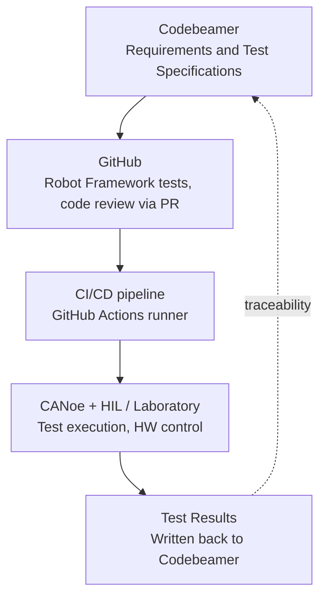
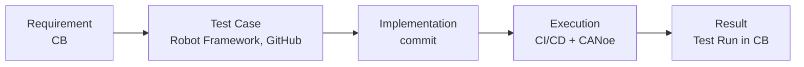
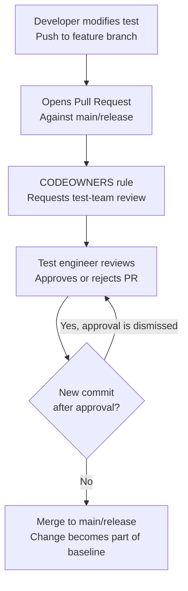

# 🤖 Embedded Software Testing Automation — Architecture and Governance 🧪

Documentation of the toolchain architecture (Codebeamer, GitHub, CI/CD, CANoe) and the rules for separating development from testing in GitHub, ensuring bi-directional traceability required by **ASPICE** and **ISO 26262**.

## 📋 Table of Contents

1. [Solution Architecture](#1-solution-architecture)
2. [Traceability and Mapping to ASPICE / ISO 26262](#2-traceability-and-mapping-to-aspice--iso-26262)
3. [Separation of Development and Testing in GitHub](#3-separation-of-development-and-testing-in-github)
4. [Test Change Approval Workflow](#4-test-change-approval-workflow)
5. [Test Change Review Checklist](#5-test-change-review-checklist)
6. [Examples](#6-examples)

---

## 🏗️ 1. Solution Architecture

The goal is to link requirements, tests written in Robot Framework, the GitHub repository, and test reviews (Codebeamer or GitHub), and subsequently link tests and their results with a test run in Codebeamer or directly in GitHub.



| Step | Description |
|---|---|
| 1. Codebeamer | Source of truth for requirements and test specifications, baseline versions. |
| 2. GitHub | Robot Framework tests, implementation, code review via Pull Request. |
| 3. CI/CD pipeline | GitHub Actions self-hosted runner, triggers tests on merge/tag. |
| 4. CANoe + HIL/Laboratory | Test execution, laboratory HW control (e.g., via SCPI/TCP-IP). |
| 5. Test Results | Parsing `output.xml` and writing the Test Run / result back to Codebeamer via REST API. |

### Requirement ID and Tagging

The link between Codebeamer and a test is realized via the requirement ID specified in the `[Tags]` of the Robot Framework test (e.g., `REQ-1234`). This ID is then also transferred to the Test Run result record, creating a complete chain:



---

## 🔗 2. Traceability and Mapping to ASPICE / ISO 26262

| Requirement | How it is covered |
|---|---|
| Bi-directional traceability | Requirement ID tag ↔ Codebeamer Test Case ↔ Test Run. |
| Configuration management | Git tags/releases synchronized with the baseline in Codebeamer. |
| Peer review evidence | Pull Request approvals in GitHub, or review workflow in Codebeamer. |
| Result reproducibility | CI/CD logs and artifacts (`log.html`, HW configuration) archived per build. |
| Impact analysis on requirement change | Codebeamer displays linked tests when a requirement work item changes. |

---

## 🛡️ 3. Separation of Development and Testing in GitHub

### Principle

GitHub does not distinguish between a "developer" and a "test engineer" as roles – it only distinguishes teams and permissions. For a test change not to pass without the test engineer's knowledge, three things must apply simultaneously:

1. A developer cannot directly push changes to a protected branch (`main`/`release`) – only via Pull Request.
2. Any change to a file in `/tests` must be approved by the `test-team` (CODEOWNERS) – regardless of who created the PR.
3. If someone adds a new commit after the PR has already been approved, the old approval is automatically canceled (*dismiss stale approvals*) – so an additional modification after approval cannot proceed without a new review.

### Repository Structure

| Option | Description | When to use |
|---|---|---|
| Separate `test-automation` repository | Tests physically separated from the SW code, custom lifecycle and permissions. | Stricter ASPICE audit, larger team. |
| Shared repository, `/tests` directory | Tests alongside the SW code, separated only via CODEOWNERS. | Smaller project, tight integration with the build. |

#### Option 1: Separate Repository
```text
organization/
├── sw-project-repo/         # Developers own this repository
│   └── src/                 # SW implementation
│
└── test-automation-repo/    # Test team owns this repository
    └── tests/               # Test cases and automation code
```

#### Option 2: Shared Repository
```text
organization/
└── shared-repo/
    ├── src/                 # Developers own this directory
    └── tests/               # Protected by CODEOWNERS (Test team owns this)
        └── ...
```

In both cases: **ownership of the directory/repository belongs to the test team**, developers have `write` access only to the feature branch, never directly to a protected branch.

### CODEOWNERS

```
# .github/CODEOWNERS
# Test files require test team approval,
# regardless of who creates the Pull Request
/tests/                    @company/test-engineers
*.robot                    @company/test-engineers
/resources/keywords/       @company/test-engineers
```

### Repository Settings (GitHub Ruleset)

Settings → Rules → Rulesets, for the `main` and `release/*` branches:

| Setting | Value | Reason |
|---|---|---|
| Require a pull request before merging | enabled | no direct push to the protected branch |
| Require review from Code Owners | enabled | enforces CODEOWNERS approval |
| Required approvals | min. 1 | at least one independent approval |
| Dismiss stale approvals on new commits | enabled | prevents pushing changes after approval |
| Require approval of the most recent push | enabled | the author cannot approve their own latest commit |
| Require signed commits | recommended | clear identity of the change author |
| Block force pushes | enabled | prevents history rewriting |
| Require linear history | enabled | clean, auditable history |
| Do not allow bypassing | no exceptions | not even a repo admin can bypass the rules |
| Restrict who can push | `release-manager`, CI account | excludes direct intervention by anyone else |

Ruleset export example:

```json
{
  "name": "protect-tests-and-release",
  "target": "branch",
  "enforcement": "active",
  "conditions": { "ref_name": { "include": ["refs/heads/main", "refs/heads/release/*"] } },
  "rules": [
    { "type": "pull_request", "parameters": {
        "required_approving_review_count": 1,
        "dismiss_stale_reviews_on_push": true,
        "require_code_owner_review": true,
        "require_last_push_approval": true
    }},
    { "type": "required_signatures" },
    { "type": "non_fast_forward" }
  ],
  "bypass_actors": []
}
```

Empty `bypass_actors` is intentional — no one, including admins, is allowed to bypass the rule.

### Release Baseline Protection (Tags)

Settings → Tag protection rules: the pattern `v*.*.*` can only be created/deleted by the `release-manager` team. A tag represents the exact version of tests executed against a specific SW build and must remain immutable as evidence for an audit.

### Audit Evidence

- Pull Request history including reviewers, comments, and approval times,
- Record of rejected force-push attempts,
- (GitHub Enterprise) Audit log recording changes in permissions, rulesets, and merge events.

### Optional Extension: Fork-based Model

With a larger or less trusted development team, developers may only have `read` access to the test repository and propose changes exclusively via **fork + Pull Request**. The developer thus has no physical way to push a branch directly to the repository — the only path is a PR from a fork, which goes through the same CODEOWNERS/ruleset mechanism.

### Responsibility Summary

| Role | Permission in the test repository |
|---|---|
| Test Engineer (CODEOWNERS) | Write + PR approval, ownership of `/tests` |
| Release Manager | Tag management, exception for merge to `release/*` |
| Developer | Read, or write only to feature branch/fork, no right to merge without approval |
| CI service account | Read for checkout, write only for publishing results |

---

## 🔄 4. Test Change Approval Workflow



1. The developer modifies the test and pushes the change to a feature branch.
2. Opens a Pull Request against the `main`/`release` branch.
3. The CODEOWNERS rule automatically requests a review from the test-team.
4. The test engineer reviews the change and approves or rejects the PR.
5. Decision point — was a new commit added after approval?
   - **Yes** → the approval is automatically canceled (*dismiss stale approval*) and the process returns to step 4.
   - **No** → the PR can proceed to merge.
6. Merge to `main`/`release` — the change becomes part of the baseline.

---

## ✅ 5. Test Change Review Checklist

Checkpoints that a test engineer should verify for every Pull Request modifying an existing test:

- **Alignment with the requirement** — the test still verifies exactly what the linked requirement (REQ-ID) states. Changing the expected result requires a corresponding change in Codebeamer.
- **No assertion weakening** — relaxing tolerance, increasing timeout, changing the verdict from `Fail` to `Pass`/`Inconclusive`, or removing a verification step. Compare values directly in the diff, not just the final file.
- **Coverage preservation** — the modification must not delete a test step or the entire test case instead of fixing it.
- **Justification in PR description** — it must be clear why the test is changing (bug fix, requirement change, refactoring).
- **Consistency with CI results** — the test actually runs in CI after the change and yields the expected result against the current SW build.
- **Traceability and documentation** — the tag/link to the requirement, the test name, and the documentation comment still match what the test actually does.

---

## 💡 6. Examples

### Robot Framework test with requirement ID tag

```robotframework
*** Test Cases ***
Actuator Moves Within Expected Time
    [Documentation]    Verifies that the actuator reaches the target position within 500 ms
    [Tags]    REQ-1234    ASIL-B
    Connect To CANoe
    Trigger Actuator Movement
    ${elapsed}=    Measure Movement Time
    Should Be True    ${elapsed} < 500
```

### Writing the result to Codebeamer via REST API (Python, simplified)

```python
import requests

def push_test_result(cb_url, token, test_case_id, requirement_id, verdict, build_version, log_path):
    payload = {
        "testCaseId": test_case_id,
        "linkedRequirement": requirement_id,
        "verdict": verdict,            # "PASS" / "FAIL" / "INCONCLUSIVE"
        "buildVersion": build_version,
        "executedBy": "ci-pipeline",
    }
    response = requests.post(
        f"{cb_url}/api/v3/testRuns",
        json=payload,
        headers={"Authorization": f"Bearer {token}"},
    )
    response.raise_for_status()

    run_id = response.json()["id"]
    with open(log_path, "rb") as f:
        requests.post(
            f"{cb_url}/api/v3/testRuns/{run_id}/attachments",
            files={"file": f},
            headers={"Authorization": f"Bearer {token}"},
        )
```

### GitHub Actions workflow (excerpt)

```yaml
name: robot-tests
on:
  pull_request:
    branches: [main, "release/**"]

jobs:
  run-tests:
    runs-on: [self-hosted, canoe]
    steps:
      - uses: actions/checkout@v4
      - name: Run Robot Framework tests
        run: robot --outputdir results tests/
      - name: Push results to Codebeamer
        run: python scripts/push_to_codebeamer.py --results results/output.xml
      - uses: actions/upload-artifact@v4
        with:
          name: robot-results
          path: results/
```
